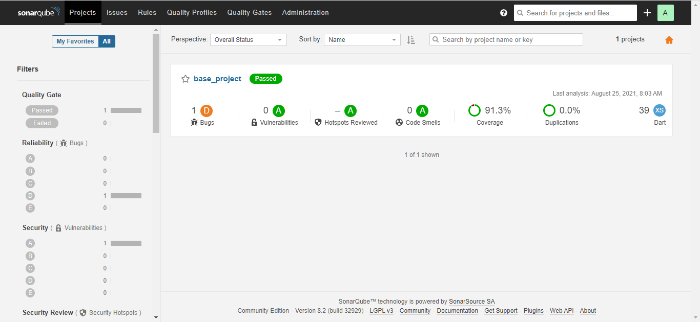

[](https://pub.dev/packages/lint)

# Base Flutter Project

New Flutter project with SonarQube configuration, lint, pre-commit and pre-push.

## SonarQube Features

See:
[Sonar Flutter Plugin](https://github.com/insideapp-oss/sonar-flutter)

| Feature    | Supported                                                       |
| ---------- | --------------------------------------------------------------- |
| Size       | YES                                                             |
| Issues     | YES ([dartanalyzer](https://dart.dev/tools/dartanalyzer) rules) |
| Tests      | YES                                                             |
| Coverage   | YES                                                             |
| Complexity | YES                                                             |
| Syntax     | YES                                                             |

## Pre requisites

### Docker

Install Docker as explained on the official documentaiton page.

[Install Docker](https://docs.docker.com/engine/install/)

### Flutter SDK

Install Flutter as explained on the official documentaiton page.

[Installation instructions](https://flutter.dev/docs/get-started/install)

### Dart

Install Dart as explained on the official documentaiton page. If you have already installed flutter, it is not necessary to install Dart.

[Install the Dart SDK](https://dart.dev/get-dart)

### sonar-scanner (requires Java)

Install sonar-scanner as explained in the official documentation. It is recommended to place it in the system environment variables.

[Installation instructions](https://docs.sonarqube.org/latest/analysis/scan/sonarscanner/)

## Docker-compose

To start the sonarqube in the docker use the following command in root:

```console
docker-compose up
```

Then check: http://localhost:9000/.

User: admin
Password: admin
It is recommended to change credentials after first login

## Run analysis

Use the following commands from the root folder to start an analysis:

```console

flutter pub get

flutter test

flutter test --machine --coverage > tests.output

sonar-scanner
```

or execute the sonar.sh in root of project in the root:

```console
./sonar.sh
```

<p style="text-align: center">
	
</p>

## Flutter Lints

See:
[Flutter lints](https://pub.dev/packages/flutter_lints)

## Pre-commit and pre-push

The project was configured with githooks to format code in pre-commit and perform code analysis and testing in pre-push.
